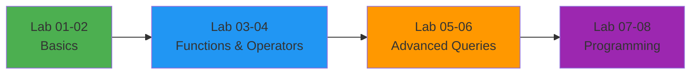

# 🗄️ CS2210 Database Management System

<div align="center">

**Complete SQL Lab Collection | 3rd Semester**

[](https://www.mysql.com/)
[](https://www.postgresql.org/)
[](.)

*Master SQL from fundamentals to advanced database programming*

[🚀 Get Started](#-quick-start) • [📚 Lab Exercises](#-lab-exercises) • [💻 Features](#-features)

</div>

---

## 📚 Lab Exercises

<div align="center">

<table>
<tr>
<td align="center" width="60">

<br><strong>Lab 01</strong>
</td>
<td width="400">
<strong>DDL & DML Operations</strong><br>
<sub>Master CREATE, ALTER, DROP, INSERT, UPDATE, DELETE commands</sub><br>
<a href="Lab01_DDL_DML_Operations.sql"><code>📄 View Lab</code></a>
</td>
</tr>

<tr>
<td align="center">

<br><strong>Lab 02</strong>
</td>
<td>
<strong>CRUD Operations</strong><br>
<sub>Complete Create, Read, Update, Delete operations with real scenarios</sub><br>
<a href="Lab02_CRUD_Operations.sql"><code>📄 View Lab</code></a>
</td>
</tr>

<tr>
<td align="center">

<br><strong>Lab 03</strong>
</td>
<td>
<strong>Built-in Functions</strong><br>
<sub>String, Math, Date functions - CONCAT, ROUND, NOW, and more</sub><br>
<a href="Lab03_Built_In_Functions.sql"><code>📄 View Lab</code></a>
</td>
</tr>

<tr>
<td align="center">

<br><strong>Lab 04</strong>
</td>
<td>
<strong>SQL Operators</strong><br>
<sub>Arithmetic, Logical, Comparison, and Set operations</sub><br>
<a href="Lab04_SQL_Operators.sql"><code>📄 View Lab</code></a>
</td>
</tr>

<tr>
<td align="center">

<br><strong>Lab 05</strong>
</td>
<td>
<strong>SQL Joins</strong><br>
<sub>INNER, LEFT, RIGHT, FULL OUTER, NATURAL joins explained</sub><br>
<a href="Lab05_SQL_Joins.sql"><code>📄 View Lab</code></a>
</td>
</tr>

<tr>
<td align="center">

<br><strong>Lab 06</strong>
</td>
<td>
<strong>GROUP BY, HAVING, ORDER BY & Indexing</strong><br>
<sub>Data aggregation, filtering, sorting, and performance optimization</sub><br>
<a href="Lab06_GROUP_BY_HAVING_ORDER_BY_INDEXING.sql"><code>📄 View Lab</code></a>
</td>
</tr>

<tr>
<td align="center">

<br><strong>Lab 07</strong>
</td>
<td>
<strong>SQL Procedures</strong><br>
<sub>Stored procedures with parameters and reusable code blocks</sub><br>
<a href="Lab07_SQL_Procedures.sql"><code>📄 View Lab</code></a>
</td>
</tr>

<tr>
<td align="center">

<br><strong>Lab 08</strong>
</td>
<td>
<strong>SQL Triggers</strong><br>
<sub>Automated database actions and audit trail implementation</sub><br>
<a href="Lab08_SQL_Triggers.sql"><code>📄 View Lab</code></a>
</td>
</tr>

</table>

</div>

---

## 🚀 Quick Start

```bash
# Clone the repository
git clone https://github.com/yourusername/CS2210_DBMS.git
cd CS2210_DBMS

# Open your favorite SQL client
# MySQL Workbench | phpMyAdmin | DBeaver | DataGrip
```

```sql
-- Execute labs in sequence
SOURCE Lab01_DDL_DML_Operations.sql;
SOURCE Lab02_CRUD_Operations.sql;
SOURCE Lab03_Built_In_Functions.sql;
-- Continue with remaining labs...
```

---

## ✨ Features

<div align="center">

| 🎯 **Comprehensive** | 💡 **Practical** | 🔍 **Well-Documented** |
|:-------------------:|:----------------:|:----------------------:|
| 8 complete lab exercises | Real-world examples | Detailed comments |
| Beginner to Expert | E-commerce & University DBs | Expected outputs included |
| All SQL concepts covered | Hands-on practice | Step-by-step guidance |

</div>

### 🌟 What's Inside

- **📖 Complete Examples** - Every query explained with context
- **✅ Expected Outputs** - Know what results to expect
- **🎯 Progressive Difficulty** - Start simple, build expertise
- **🏢 Real-World Scenarios** - University, E-commerce, Employee databases
- **⚡ Performance Tips** - Indexing and optimization strategies
- **🔒 Best Practices** - Industry-standard SQL coding patterns

---

## 📖 Prerequisites

- Basic understanding of relational databases
- MySQL 5.7+ or compatible SQL database
- SQL client (MySQL Workbench, phpMyAdmin, etc.)

---

## 🎓 Learning Path



<div align="center">

**Start simple → Build skills → Master advanced concepts → Become an expert**

</div>

---
